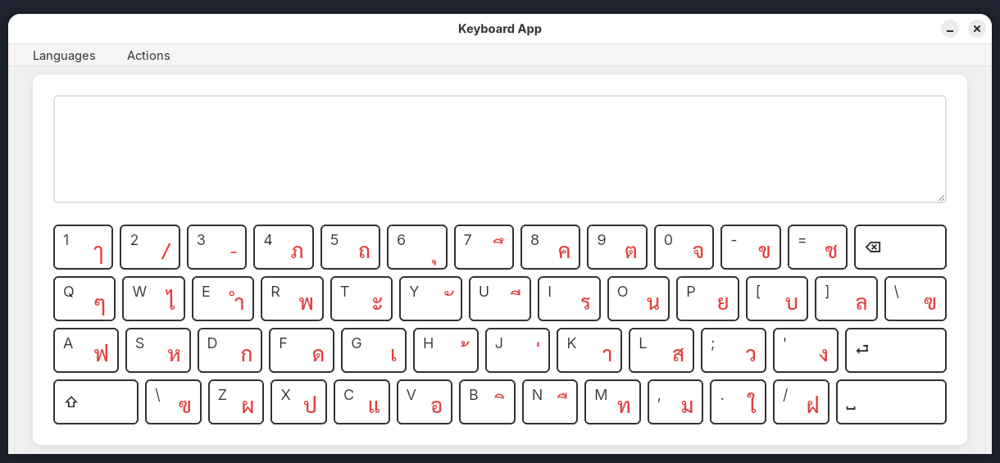

<h1> keyboard-app </h1>

[](https://github.com/mrwormhole/keyboard-app/tags)
[](https://github.com/mrwormhole/keyboard-app/blob/main/LICENSE)

Cross-platform on-screen keyboard for different languages, keyboard app supersedes [virtual-keyboard](https://github.com/mrwormhole/virtual-keyboard)



### Getting Started

Grab the app from latest releases [here](https://github.com/mrwormhole/keyboard-app/releases)

Or build locally

```shell
git clone https://github.com/mrwormhole/keyboard-app
pnpm install # or npm install
pnpm tauri build # or npm tauri build
```

### FAQs

- Do you plan to add more languages?

We can consider as long as we don't break existing languages, I will not support chinese/japanese due to the complexity it brings.

- Do you plan to add support for Windows or Macos?

Already supported but my machines run on Linux so you have to report the issues if you encounter it on Windows or Macos.

- Why Tauri?

Smallest bundles and easy to port across different platforms.
